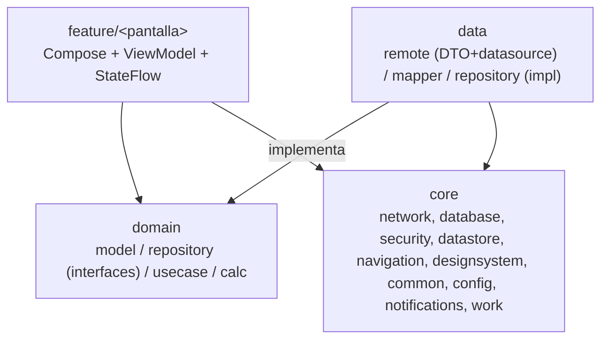
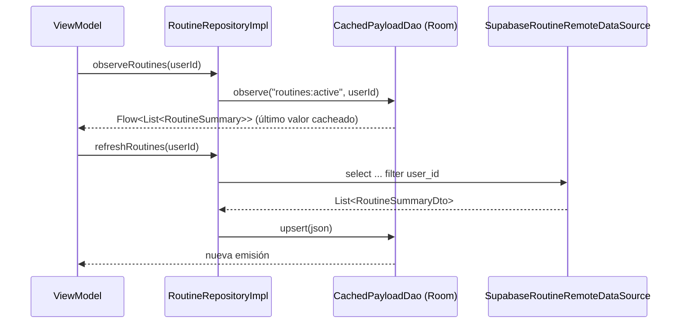
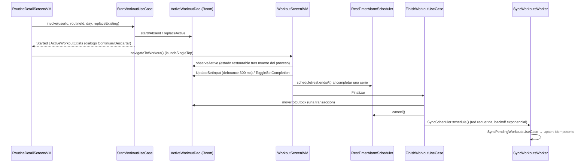
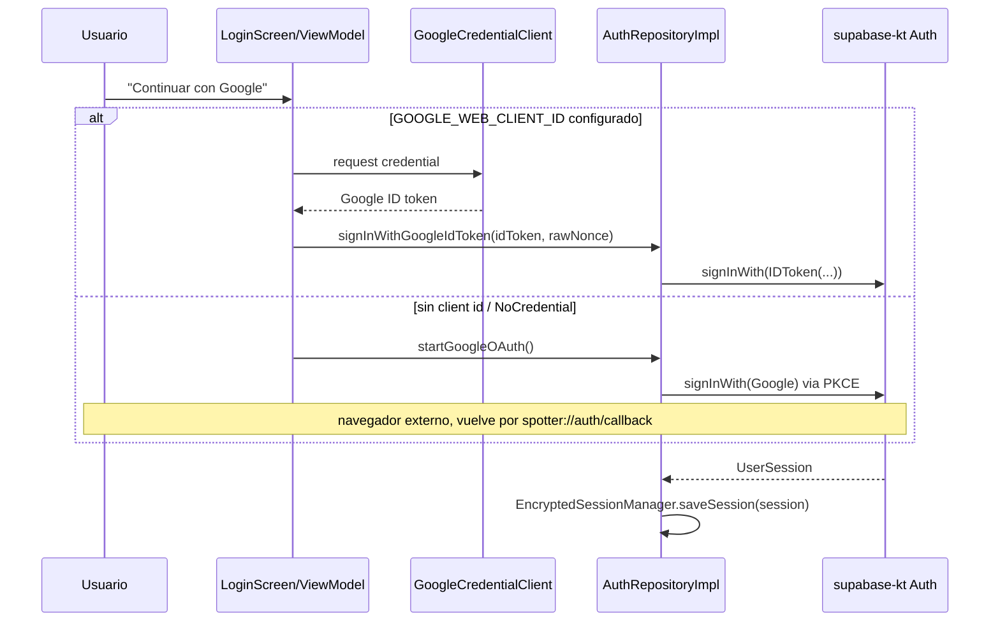

# Arquitectura de Spotter

Estado: refleja el código tras **FASES 1-6** (FASES 1-4 aprobadas el 2026-09-26; FASES 5-6
implementadas sin revisión independiente ni compilación de Android, solo 147 tests de dominio
verificados en arnés JVM; 571 tests totales escritos). La sección final "Planificado" documenta lo
que el plan define para FASE 7 y que **no existe todavía** en el código.

## Visión general

Un solo módulo Gradle `:app` (ADR A1 en `MIGRATION_PLAN.md` §3) con capas inspiradas en la *Guide
to app architecture* de Google: `feature` (UI) → `domain` (modelos e interfaces) ← `data`
(implementaciones) + `core` (infraestructura transversal). La regla de dependencias es estricta:
`feature` nunca importa `data` directamente, solo `domain`.



## Estructura de paquetes (resumen)

Ver el detalle completo en [`estructura.md`](estructura.md). Resumen de responsabilidades:

| Paquete | Responsabilidad |
|---|---|
| `core/common` | `AppResult`/`AppError` (errores tipados), `ValidationReason`, `TimeProvider`, `IdGenerator`, `Logger`, dispatchers cualificados |
| `core/config` | `AppConfig` (validación de URL/claves de Supabase en runtime) |
| `core/database` | Room v1: entidades, DAOs, `SpotterDatabase` |
| `core/datastore` | Dos `DataStore<Preferences>` con nombre: `secure_auth` (sesión/PKCE cifrados) y `user_prefs` |
| `core/designsystem` | Tema Compose + componentes reutilizables: `StatCard`, `LineChart`, `LineChartGeometry`, `ActiveWorkoutBanner` (FASE 5) |
| `core/navigation` | Rutas `@Serializable`, `SpotterNavHost`, `DeepLinkParser`, `TopLevelDestination`, `NavController.navigateToTopLevel()` (FASE 5) |
| `core/network` | Cliente Supabase, `safeCall`/`ErrorMapper`, `NetworkMonitor` |
| `core/security` | Cifrado Tink + Android Keystore de sesión y code verifier |
| `core/notifications` | Canal `rest_timer`, alarma de fin de descanso (`RestTimerAlarmScheduler`) y `RestTimerReceiver` |
| `core/work` | `SyncWorkoutsWorker` + `SyncScheduler` (WorkManager) para subir el outbox |
| `domain/model` | Modelos puros de negocio (sin Android, sin DTOs); FASE 5: `DashboardStats`, `ProfileOverview`, `ProfileEdit` |
| `domain/repository` | Interfaces de repositorio (12) + `LocalDataRepository` (FASE 5) |
| `domain/usecase` | `AdoptTemplateUseCase` (FASE 3); 6 use cases del entrenamiento activo y sincronización (FASE 4); 5 use cases de historial/progreso/dashboard/perfil (FASE 5): `GetDashboardStatsUseCase`, `GetExerciseProgressUseCase`, `GetProfileOverviewUseCase`, `UpdateProfileUseCase`, `SignOutUseCase` |
| `domain/calc` | Cálculos puros testeables (peso, edad, semana, orden, etc.); FASE 5: `SetInputValidator` |
| `data/remote` | DTOs `@Serializable` + data sources `Supabase*RemoteDataSource` |
| `data/mapper` | DTO/Entity ↔ dominio |
| `data/repository` | Implementaciones de las 12 interfaces de `domain/repository` |
| `feature/*` | Pantallas Compose + ViewModel por función |

## Inyección de dependencias (Hilt + KSP)

Todos los módulos son `@InstallIn(SingletonComponent::class)`. No se usa `kapt` (AGP 9 lo
prohíbe con el Kotlin integrado), solo KSP. Módulos presentes: `CommonModule`, `ConfigModule`,
`SecurityModule`, `NetworkModule`, `SupabaseModule` (cliente Supabase, `Json`, `Auth`/`Postgrest`/
`Functions`), `DatabaseModule` (Room), `DataStoreModule` (los dos `DataStore` nombrados con
`@Named`), `DataSourceModule` (bindings de los `*RemoteDataSource`), `RepositoryModule` (bindings
de los 12 repositorios), `NotificationsModule` (`RestTimerAlarmScheduler`) y `WorkModule`
(`SyncScheduler`). `SpotterApp` es `@HiltAndroidApp` y además `Configuration.Provider` (inyecta
`HiltWorkerFactory`, que construye el `@HiltWorker` `SyncWorkoutsWorker`) y
`SingletonImageLoader.Factory` (Coil, con decoder de GIF animado).

## Flujo de datos: cache-then-network

`RoutineRepositoryImpl` y `ExerciseRepositoryImpl` implementan el mismo patrón: `observe*` lee
primero `CachedPayloadDao` (una fila `CachedPayloadEntity` con un JSON tipado por `key`/`userId`) y
`refresh*` trae de Supabase y hace upsert de ese JSON. Cada mutación exitosa sobre una rutina
dispara un `refreshRoutine`/`refreshRoutines` para mantener el caché consistente.



Historial, progreso, plantillas y perfil (`WorkoutHistoryRepository`, `ProgressRepository`,
`TemplateRepository`, `ProfileRepository`) van solo por red, con `AppResult` de error explícito —
no tienen caché local (ver `MIGRATION_PLAN.md` ADR A3).

El entrenamiento activo (`ActiveWorkoutRepository`) y el outbox de sincronización
(`PendingWorkoutRepository`) tienen su propio esquema Room relacional (no JSON), que es la fuente
de verdad mientras se entrena — ver "Room" más abajo y la sección siguiente.

## Entrenamiento activo, descanso y sincronización offline (FASE 4)



- **Room como única fuente de verdad**: `WorkoutViewModel` observa la sesión activa; los textos
  en edición viven como borradores en memoria y se persisten con `debounce(300)` y flush inmediato
  al completar, cambiar de ejercicio o en `onCleared`. Matar el proceso no pierde el
  entrenamiento ni el descanso (`RestTimer.endsAt` es un instante absoluto).
- **Descanso en background**: al completar una serie se agenda una alarma exacta (o inexacta si no
  hay permiso de alarmas exactas). `RestTimerReceiver` no notifica si la app está en primer plano
  (ahí suena el beep in-app); si no, muestra "Descanso terminado" y el tap abre `MainActivity` con
  `open_workout=true` → `RootViewModel.pendingOpenWorkout` → `SpotterRoot` navega a `WorkoutRoute`.
- **Outbox**: `FinishWorkoutUseCase` convierte a kg y mueve la sesión al outbox en una sola
  transacción; `SyncWorkoutsWorker` (trabajo único `sync_workouts`) sube las filas del usuario
  actual, reintenta errores transitorios y marca `FAILED` los permanentes. `RootViewModel` también
  agenda la sincronización al iniciar sesión (no solo en la transición offline→online, bug #3 de
  RN). `WorkoutScreen` muestra un banner "Sin conexión" según `NetworkMonitor`.

## Autenticación y sesión



`RootViewModel` combina `AuthRepository.authState` (`Loading`/`SignedOut`/`SignedIn`) con
`PreferencesRepository.isOnboardingDone(userId)` para decidir `RootUiState`
(`Loading`/`ConfigError`/`SignedOut`/`SignedIn(needsOnboarding)`). `SpotterRoot` renderiza
`LoginScreen`, `ConfigErrorScreen` o el `NavHost` autenticado según ese estado. Al pasar a
`SignedIn` por primera vez en la sesión del proceso, sincroniza el `display_name` del perfil
(`syncProfileDisplayName`) y agenda la sincronización del outbox. El cierre de sesión invoca `SignOutUseCase` (FASE 5), que cancela la alarma de descanso y el
worker de sincronización, borra Room entero (entrenamiento activo + outbox + caché), llama
`AuthRepository.signOut()` y borra las preferencias por usuario (conserva unidad kg/lb). Si el
borrado de Room falla, no cierra sesión y reprograma la sincronización para reintentar.

`MainActivity` valida `AppConfig.isValid` antes de tocar el `SupabaseClient` (inyectado como
`Lazy<SupabaseClient>` para no construirlo si la config es inválida) y muestra
`ConfigErrorScreen` en ese caso.

## Navegación y eventos one-shot

- Rutas `@Serializable` (`core/navigation/Routes.kt`) en un único `NavHost` (`SpotterNavHost`)
  dentro de la raíz autenticada. La barra inferior (`TopLevelDestination`: Dashboard, Rutinas,
  Historial, Progreso, Perfil) se muestra en esos 5 destinos top-level (Dashboard, Historial y
  Progreso implementados en FASE 5; ImportCodeRoute e ImportImageRoute implementadas en FASE 6).
- Los ViewModels con argumentos de ruta leen el `SavedStateHandle` directamente por clave
  (`RouteArgs`), no con `toRoute<T>()`: se verificó que `toRoute()` no decodifica argumentos cuando
  el `SavedStateHandle` no viene de un `NavBackStackEntry` real, lo que rompía los tests con fakes
  (desviación de FASE 3, ver `MIGRATION_PLAN.md` §10).
- **Deep links no usan `navDeepLink`**: `DeepLinkParser` los valida (scheme + host + path,
  `spotter://auth/...` y `spotter://import/{code}`) y `RootViewModel` encola el código de
  importación pendiente hasta que hay sesión iniciada; `SpotterRoot` navega a `ImportCodeRoute` en
  cuanto el `NavHost` tiene un back stack real.
- **Dos guards distintos y no intercambiables**, documentados en el KDoc de
  `feature/common/ObserveAsEvents.kt` y de `SpotterNavHost.kt`:
  - `dropUnlessResumed`/`dropUnlessResumed1`/`dropUnlessResumed2` (este último par, local al nav
    host) protegen **clicks de usuario** contra doble-tap o una carrera con el gesto de back.
  - `ObserveAsEvents` (un `@Composable` que envuelve `repeatOnLifecycle(STARTED)`) protege el
    **consumo de eventos de un `Channel`** disparados por una operación async (guardar rutina,
    adoptar plantilla, agregar ejercicio, archivar, onboarding): un `LaunchedEffect(Unit)` plano
    sigue consumiendo aunque la pantalla esté en background, así que envolver el *callback* (en
    vez de la *colección*) con `dropUnlessResumed` descartaba el evento para siempre. Esto fue un
    bug bloqueante encontrado y corregido en el ciclo 4 de revisión de FASE 3.
  - Mismo criterio en FASE 4: `RoutineDetailScreen.onOpenWorkout` lo dispara el evento
    `WorkoutStarted`, así que va **sin** `dropUnlessResumed` (`ObserveAsEvents` puede entregar el
    evento en `STARTED`, antes de `ON_RESUME`, y el guard lo descartaría). La doble navegación la
    evita `NavController.navigateToWorkout()` con `launchSingleTop`, que también usan el banner de
    `RoutinesScreen` y la notificación de descanso.
- Resultados de navegación "de vuelta" (rutina creada desde plantilla, ejercicio agregado) se
  relayan vía `NavBackStackEntry.savedStateHandle`, leídos con `getStateFlow(...)` envuelto en
  `remember(entry)` para no cancelar un snackbar en curso en una recomposición.

## Modelo de errores

```kotlin
sealed interface AppError {
    data object Network : AppError
    data object Unauthorized : AppError
    data object NotFound : AppError
    data class Conflict(val detail: String? = null) : AppError
    data class Validation(val reason: ValidationReason) : AppError
    data class Server(val code: String? = null, val message: String? = null) : AppError
    data class Unknown(val cause: Throwable? = null) : AppError   // cause solo para logging debug
}

sealed interface AppResult<out T> {
    data class Success<T>(val value: T) : AppResult<T>
    data class Failure(val error: AppError) : AppResult<Nothing>
}

suspend fun <T> safeCall(block: suspend () -> T): AppResult<T>   // relanza CancellationException
```

`ErrorMapper` (en `core/network/SafeCall.kt`) traduce excepciones de supabase-kt/Ktor/serialization
a `AppError`, con cuidado explícito de **nunca** usar `Throwable.message`/`toString()` de una
`RestException` (embebe la URL y el header `Authorization: Bearer <jwt>`). La UI traduce `AppError`
a strings localizados con `AppError.toMessageRes()`/`toLoginMessageRes()`
(`feature/common/ErrorMessages.kt`); `ValidationReason.toMessageRes()` hace lo mismo para errores de
validación de dominio (`feature/common/ValidationMessages.kt`).

## Base de datos (Room, versión 1)

Esquema exportado a `app/schemas/` (`room { schemaDirectory(...) }`). Tres grupos de entidades:

| Entidad | Rol |
|---|---|
| `CachedPayloadEntity` | Caché de lectura JSON tipado por `(key, userId)`, usado por rutinas y catálogo de ejercicios |
| `ActiveSessionEntity` / `ActiveExerciseEntity` / `ActiveSetEntity` | Entrenamiento en curso (fuente única de verdad mientras se entrena); `ActiveWorkoutDao` expone operaciones atómicas (`startIfAbsent`, `replaceActive`, `insertNextSet`) para evitar condiciones de carrera |
| `PendingWorkoutEntity` / `PendingWorkoutSetEntity` | Outbox de entrenamientos finalizados pendientes de subir; `PendingWorkoutDao` tiene estados `PENDING`/`FAILED` con reintentos (`recordAttempt`, `markFailed`, `resetToPending`) |

En debug, `DatabaseModule` usa `fallbackToDestructiveMigration(dropAllTables = true)` (no hay v2
todavía); en release nunca se aplica ese fallback — una migración real será obligatoria desde v2.

## Seguridad

### Cifrado de sesión (Tink + Android Keystore)

```
UserSession (JSON) --AES256-GCM(AD="spotter.session")--> Base64 --> DataStore "secure_auth"
                              ↑
                    Aead protegido por una master key en Android Keystore
                    ("spotter_master_key", alias android-keystore://...)
```

`EncryptedSessionManager` implementa `io.github.jan.supabase.auth.SessionManager` (reemplaza el
default de supabase-kt, que persiste en SharedPreferences en texto plano);
`EncryptedCodeVerifierCache` implementa `CodeVerifierCache` con el mismo esquema para el code
verifier de PKCE. Ambos tratan cualquier dato corrupto o no desencriptable como "no hay sesión" en
vez de propagar la excepción.

`TinkAeadProvider` memoiza el `Aead` a mano (no con `by lazy`, que no cachea una excepción) y
delega la política de reintento en `KeysetRecoveryPolicy`:

1. Primer fallo → espera 100-300 ms y reintenta una vez sin acción destructiva.
2. Segundo fallo, si es un error "razonable" (`GeneralSecurityException`, `ProviderException`,
   `KeyStoreException`, `IOException`) → borra el keyset envuelto y la entrada del Keystore
   (`wipe`) y reconstruye una sola vez.
3. Si eso también falla, la excepción se propaga (fail-closed: nunca cae a un keyset sin cifrar).
4. Incluso si la construcción tuvo éxito, si el resultado no está respaldado por el Keystore
   (`isUsingKeystore` en falso — Tink puede escribir el keyset en claro si no puede usar el
   Keystore), se borra igual y se lanza un error.

### Configuración del manifest y red

- `android:allowBackup="false"`, `fullBackupContent="false"`, `dataExtractionRules` excluye
  cloud-backup/device-transfer.
- `usesCleartextTraffic="false"` + `network_security_config.xml` (sin certificate pinning: el
  proyecto rota certificados en Supabase).
- `Logger` (`AndroidLogger`) es no-op fuera de `BuildConfig.DEBUG`; nunca loguea URLs, tokens ni PII.
- Deep links validados por `DeepLinkParser`; la importación por código exige confirmación
  explícita del usuario (pantalla real: FASE 6, ver "Planificado").
- `POST_NOTIFICATIONS` se pide en runtime (API 33+) la primera vez que se inicia un
  entrenamiento; si se deniega, el entrenamiento sigue sin notificación.
  `SCHEDULE_EXACT_ALARM` se usa solo si `canScheduleExactAlarms()`; si no, la alarma cae a
  `setAndAllowWhileIdle`. `RestTimerReceiver` no está exportado y los `PendingIntent` usan
  `FLAG_IMMUTABLE`.

### Backend (Supabase)

Sin cambios de esquema. Decisión del usuario (2026-09-25): **no modificar el backend en vivo**.
Los hallazgos B1 (crítico, `parse-routine-image` confía en `user_id` del body con la service role
key), B2 (alto, lectura de rutinas compartidas sin autenticación), B3-B6 siguen abiertos — detalle
en `MIGRATION_PLAN.md` §8 y en [`review_carryover.md`](review_carryover.md). Existe una corrección
revisada y aprobada para B1/B2/B6 en [`supabase/_proposed/README.md`](../supabase/_proposed/README.md),
no aplicada. Esquema en vivo documentado en
[`docs/backend/live_schema_2026-09-26.md`](backend/live_schema_2026-09-26.md).

## Decisiones de arquitectura (ADR)

Registro completo con la justificación de cada una en `MIGRATION_PLAN.md` §3 (A1-A12). Estado de
cada una a fines de FASE 4:

| ADR | Decisión | Estado |
|---|---|---|
| A1 | Módulo único `:app`, paquetes `core/domain/data/feature` | Vigente |
| A2 | Capas de la Architecture Guide; UDF con `StateFlow` + `Channel` | Vigente |
| A3 | Offline-first: Room activo/outbox + caché JSON | Vigente: `WorkoutScreen` sobre Room + outbox sincronizado por WorkManager |
| A4 | Hilt + KSP (no kapt) | Vigente |
| A5 | Navigation Compose 2.9.8, rutas `@Serializable`, deep links fuera de `navDeepLink` | Vigente |
| A6 | supabase-kt 3.8.0 (Auth/Postgrest/Functions) + Ktor OkHttp | Vigente |
| A7 | Login Google: Credential Manager primario, PKCE de respaldo | Vigente |
| A8 | Sesión cifrada Tink + Keystore | Vigente |
| A9 | `AppResult`/`AppError` + `safeCall` | Vigente |
| A10 | Gráfico propio en `Canvas` + `sh.calvin.reorderable` para drag & drop | Reordenamiento en `RoutineDetailScreen` (FASE 3); gráfico de progreso en `feature/progress/LineChart` (FASE 5) |
| A11 | Exportación nativa (PDF + JPEG de "historia") | No implementado (FASE 6) |
| A12 | Peso siempre en kg, conversión solo de presentación | `FinishWorkoutUseCase` convierte a kg (FASE 4); UI de unidad kg/lb en `ProfileScreen` (FASE 5) |

## Planificado (no implementado — FASE 7)

Documentado acá solo para dejar explícito qué falta; **nada de lo siguiente existe en el código
hoy**. Ver `MIGRATION_PLAN.md` §10 para el detalle.

- **FASE 7:** endurecimiento de release y verificación en dispositivo/emulador real.

## Referencias

- [`MIGRATION_PLAN.md`](MIGRATION_PLAN.md) — plan completo, inventario funcional, bugs de RN evitados, hallazgos de backend, pasos detallados por fase.
- [`estructura.md`](estructura.md) — árbol de paquetes.
- [`componentes.md`](componentes.md) — clases e interfaces principales.
- [`changelog.md`](changelog.md) — cambios por fase.
- [`review_carryover.md`](review_carryover.md) — ítems de revisión diferidos a fases futuras.
