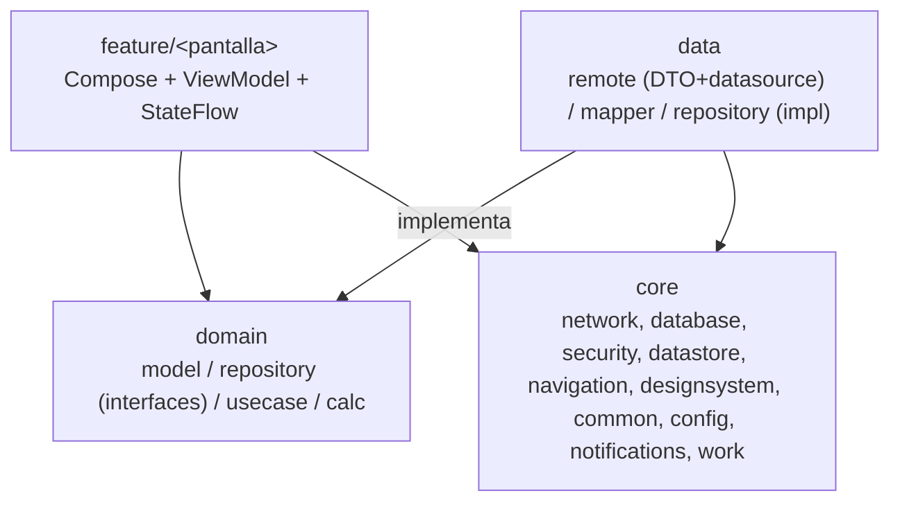
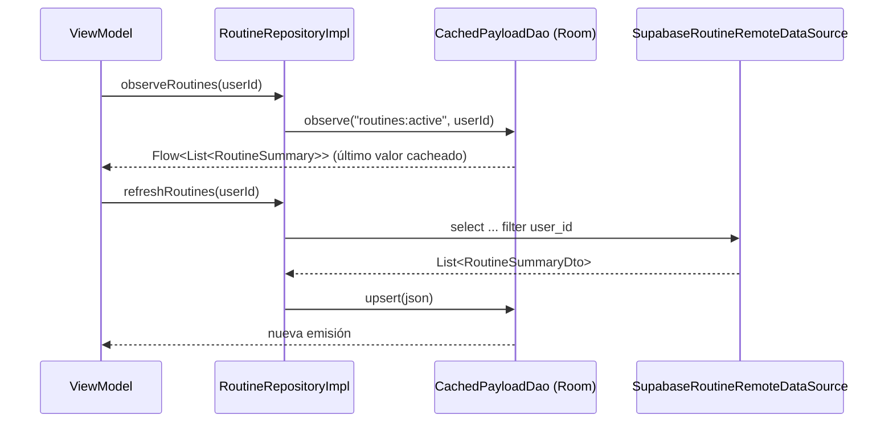
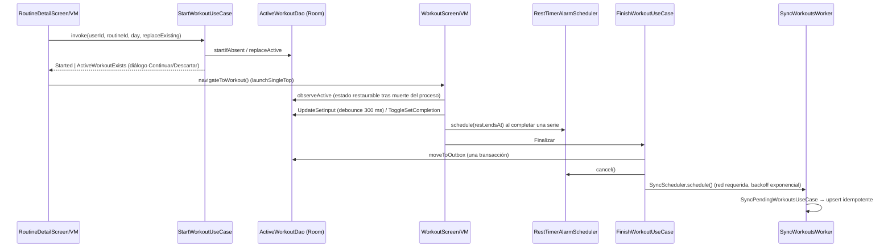
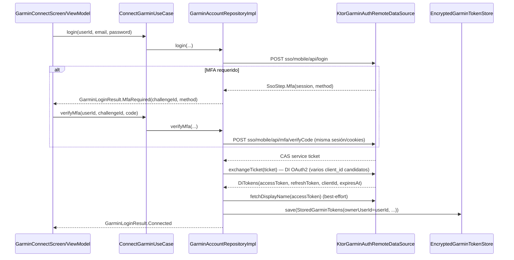
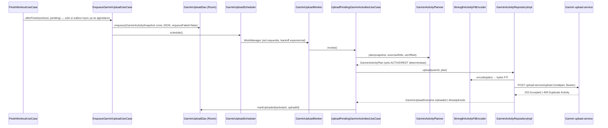
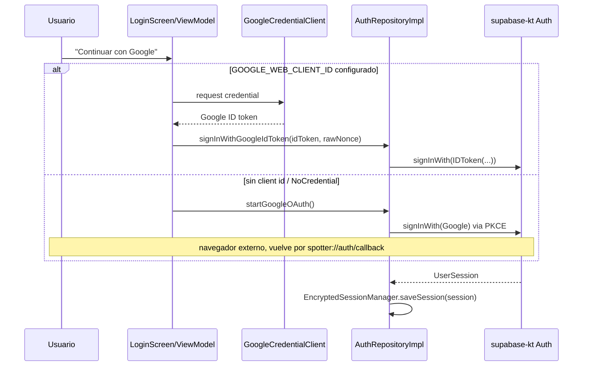

# Arquitectura de Spotter

Estado: refleja el código tras **FASES 1-7** (FASES 1-4 aprobadas el 2026-09-26; FASES 5-7
implementadas sin revisión independiente) **más la integración con Garmin Connect** (2026-09-28,
también sin revisión independiente). El 2026-09-28 se compiló y probó por primera vez el árbol
completo de Android en una máquina con SDK real: `./gradlew :app:testDebugUnitTest` (**785 @Test,
0 fallos**), `:app:assembleDebug` y `:app:assembleRelease` terminan sin errores (`:app:lintDebug`
falla por 34 errores preexistentes no relacionados; ver `README.md`). Queda pendiente la
verificación en dispositivo/emulador real y una revisión independiente de FASES 5-7 y de Garmin.

## Visión general

Un solo módulo Gradle `:app` (ADR A1 en `MIGRATION_PLAN.md` §3) con capas inspiradas en la *Guide
to app architecture* de Google: `feature` (UI) → `domain` (modelos e interfaces) ← `data`
(implementaciones) + `core` (infraestructura transversal). La regla de dependencias es estricta:
`feature` nunca importa `data` directamente, solo `domain`.



## Estructura de paquetes (resumen)

Ver el detalle completo en [`estructura.md`](estructura.md). Resumen de responsabilidades:

| Paquete | Responsabilidad |
|---|---|
| `core/common` | `AppResult`/`AppError` (errores tipados), `ValidationReason`, `TimeProvider`, `IdGenerator`, `Logger`, dispatchers cualificados |
| `core/config` | `AppConfig` (validación de URL/claves de Supabase en runtime) |
| `core/database` | Room v1: entidades, DAOs, `SpotterDatabase` |
| `core/datastore` | Dos `DataStore<Preferences>` con nombre: `secure_auth` (sesión/PKCE cifrados) y `user_prefs` |
| `core/designsystem` | Tema Compose + componentes reutilizables: `StatCard`, `LineChart`, `LineChartGeometry`, `ActiveWorkoutBanner` (FASE 5) |
| `core/navigation` | Rutas `@Serializable`, `SpotterNavHost`, `DeepLinkParser`, `TopLevelDestination`, `NavController.navigateToTopLevel()` (FASE 5) |
| `core/network` | Cliente Supabase, `safeCall`/`ErrorMapper`, `NetworkMonitor` |
| `core/security` | Cifrado Tink + Android Keystore de sesión y code verifier |
| `core/notifications` | Canal `rest_timer`, alarma de fin de descanso (`RestTimerAlarmScheduler`) y `RestTimerReceiver` |
| `core/work` | `SyncWorkoutsWorker` + `SyncScheduler` (WorkManager) para subir el outbox; `GarminUploadWorker` + `GarminUploadScheduler` para subir a Garmin Connect |
| `domain/model` | Modelos puros de negocio (sin Android, sin DTOs); FASE 5: `DashboardStats`, `ProfileOverview`, `ProfileEdit`; Garmin: `GarminModels.kt` (`GarminError`, `GarminResult`, `GarminConnectionState`, `GarminActivitySnapshot`, `GarminActivityPlan`, etc.) |
| `domain/repository` | Interfaces de repositorio (12) + `LocalDataRepository` (FASE 5) + `GarminAccountRepository`/`GarminActivityRepository`/`GarminUploadRepository` |
| `domain/usecase` | `AdoptTemplateUseCase` (FASE 3); 6 use cases del entrenamiento activo y sincronización (FASE 4); 5 use cases de historial/progreso/dashboard/perfil (FASE 5): `GetDashboardStatsUseCase`, `GetExerciseProgressUseCase`, `GetProfileOverviewUseCase`, `UpdateProfileUseCase`, `SignOutUseCase`; Garmin: `ConnectGarminUseCase`, `DisconnectGarminUseCase`, `EnqueueGarminUploadUseCase`, `RetryFailedGarminUploadsUseCase`, `UploadPendingGarminActivitiesUseCase` |
| `domain/calc` | Cálculos puros testeables (peso, edad, semana, orden, etc.); FASE 5: `SetInputValidator`; Garmin: `GarminActivityPlanner`, `GarminExerciseMapper` |
| `data/remote` | DTOs `@Serializable` + data sources `Supabase*RemoteDataSource` |
| `data/mapper` | DTO/Entity ↔ dominio |
| `data/repository` | Implementaciones de las 12 interfaces de `domain/repository` |
| `data/garmin` | Cliente de la API no oficial de Garmin Connect: `fit/` (encoder FIT propio), `remote/` (SSO + DI OAuth2 + subida), `local/` (tokens cifrados), `mapper/` (snapshot ↔ JSON); repos `Garmin*RepositoryImpl` |
| `feature/*` | Pantallas Compose + ViewModel por función; `feature/garmin/` (conectar Garmin, sección en Perfil) |

## Inyección de dependencias (Hilt + KSP)

Todos los módulos son `@InstallIn(SingletonComponent::class)`. No se usa `kapt` (AGP 9 lo
prohíbe con el Kotlin integrado), solo KSP. Módulos presentes: `CommonModule`, `ConfigModule`,
`SecurityModule`, `NetworkModule`, `SupabaseModule` (cliente Supabase, `Json`, `Auth`/`Postgrest`/
`Functions`), `DatabaseModule` (Room), `DataStoreModule` (los dos `DataStore` nombrados con
`@Named`), `DataSourceModule` (bindings de los `*RemoteDataSource`), `RepositoryModule` (bindings
de los 12 repositorios), `NotificationsModule` (`RestTimerAlarmScheduler`), `WorkModule`
(`SyncScheduler` y `GarminUploadScheduler`) y `GarminModule` (bindings del cliente Garmin: HTTP
factory, data sources, `GarminTokenStore`, los tres repositorios `Garmin*`). `SpotterApp` es
`@HiltAndroidApp` y además `Configuration.Provider` (inyecta `HiltWorkerFactory`, que construye los
`@HiltWorker` `SyncWorkoutsWorker` y `GarminUploadWorker`) y `SingletonImageLoader.Factory` (Coil,
con decoder de GIF animado).

## Flujo de datos: cache-then-network

`RoutineRepositoryImpl` y `ExerciseRepositoryImpl` implementan el mismo patrón: `observe*` lee
primero `CachedPayloadDao` (una fila `CachedPayloadEntity` con un JSON tipado por `key`/`userId`) y
`refresh*` trae de Supabase y hace upsert de ese JSON. Cada mutación exitosa sobre una rutina
dispara un `refreshRoutine`/`refreshRoutines` para mantener el caché consistente.



Historial, progreso, plantillas y perfil (`WorkoutHistoryRepository`, `ProgressRepository`,
`TemplateRepository`, `ProfileRepository`) van solo por red, con `AppResult` de error explícito —
no tienen caché local (ver `MIGRATION_PLAN.md` ADR A3).

El entrenamiento activo (`ActiveWorkoutRepository`) y el outbox de sincronización
(`PendingWorkoutRepository`) tienen su propio esquema Room relacional (no JSON), que es la fuente
de verdad mientras se entrena — ver "Room" más abajo y la sección siguiente.

## Entrenamiento activo, descanso y sincronización offline (FASE 4)



- **Room como única fuente de verdad**: `WorkoutViewModel` observa la sesión activa; los textos
  en edición viven como borradores en memoria y se persisten con `debounce(300)` y flush inmediato
  al completar, cambiar de ejercicio o en `onCleared`. Matar el proceso no pierde el
  entrenamiento ni el descanso (`RestTimer.endsAt` es un instante absoluto).
- **Descanso en background**: al completar una serie se agenda una alarma exacta (o inexacta si no
  hay permiso de alarmas exactas). `RestTimerReceiver` no notifica si la app está en primer plano
  (ahí suena el beep in-app); si no, muestra "Descanso terminado" y el tap abre `MainActivity` con
  `open_workout=true` → `RootViewModel.pendingOpenWorkout` → `SpotterRoot` navega a `WorkoutRoute`.
- **Outbox**: `FinishWorkoutUseCase` convierte a kg y mueve la sesión al outbox en una sola
  transacción; `SyncWorkoutsWorker` (trabajo único `sync_workouts`) sube las filas del usuario
  actual, reintenta errores transitorios y marca `FAILED` los permanentes. `RootViewModel` también
  agenda la sincronización al iniciar sesión (no solo en la transición offline→online, bug #3 de
  RN). `WorkoutScreen` muestra un banner "Sin conexión" según `NetworkMonitor`.

## Integración con Garmin Connect

Sube un entrenamiento finalizado a Garmin Connect como actividad "Strength Training"
(`Sport.TRAINING` / `SubSport.STRENGTH_TRAINING`). Es **enteramente del lado del cliente**, sin
tocar `supabase/`, y **best-effort**: nunca puede afectar el resultado de `FinishWorkoutUseCase` ni
la sincronización propia del outbox (`SyncWorkoutsWorker`/`sync_workouts`) — son mecanismos
totalmente independientes, con su propia tabla Room, su propio worker y su propio tipo de error
(`GarminError`/`GarminResult`, en `domain/model/GarminModels.kt`, deliberadamente separado de
`AppError`/`AppResult` para no romper los `when` exhaustivos existentes).

### Por qué una API no oficial

Garmin no ofrece una API pública para subir actividades de terceros sin partnership. La integración
usa la misma API HTTP no documentada que usan `garth`/`python-garminconnect` y la app oficial de
Garmin Connect: login SSO (usuario/contraseña) → ticket de servicio CAS → intercambio por un token
Bearer OAuth2 del servicio "DI" (Device Identity), con refresh token. El flujo de `garth` (OAuth1 +
firma con una consumer key de S3) dejó de funcionar en 2026; `data/garmin/remote/GarminEndpoints.kt`
documenta que esta integración sigue en cambio la estrategia "mobile + requests" de
`python-garminconnect`: HTTP plano con cabeceras fijas de la app móvil oficial, **sin ninguna
evasión de detección de bots**. Un CAPTCHA, un bloqueo (403) o un límite de tasa (429) del lado de
Garmin se traducen a un error tipado y se muestran al usuario tal cual, nunca se intenta sortearlos.
Riesgo aceptado explícitamente: Garmin puede cambiar este flujo en cualquier momento y romper la
integración (`GarminError.ServiceChanged`).

### Login y tokens



- `GarminAccountRepositoryImpl` guarda el desafío de MFA en memoria (`pendingMfa`, con id generado
  por `IdGenerator`, TTL de 10 minutos) — no en Room ni DataStore. La sesión con cookies
  (`GarminSsoSession`) se cierra en cuanto se obtiene el ticket, en el fallo, o al vencer/consumirse
  el MFA.
- **La contraseña nunca se persiste**: solo viaja en memoria durante el login. Lo que sí se guarda,
  cifrado, son `accessToken`/`refreshToken`/`clientId`/`accessExpiresAtEpochSec` y el `ownerUserId`
  (`StoredGarminTokens`, en `EncryptedGarminTokenStore`, mismo esquema Tink + Android Keystore que
  `EncryptedSessionManager` — ver "Seguridad" más abajo —, en el mismo DataStore `secure_auth` bajo
  una clave propia).
- **`ownerUserId` es la barrera de seguridad real** entre cuentas de Spotter: si el usuario actual no
  coincide con el dueño de los tokens guardados, `GarminConnectionState` es `NotConnected` aunque
  haya tokens en disco (por ejemplo, tras cambiar de cuenta de Spotter sin desconectar Garmin antes).
- `GarminTokenManager` es el único punto que entrega un access token válido: refresca si falta menos
  de un margen fijo para que expire (o si se lo fuerza tras un 401), todo bajo un `Mutex` para que un
  worker en carrera con un login/reconexión nunca dispare dos refresh simultáneos contra el mismo
  refresh token. Un refresh rechazado marca `needsReconnect = true` (no borra los tokens); un error
  transitorio (red, 5xx, límite de tasa) los deja intactos para el próximo intento.

### Construcción del archivo FIT y subida



- **Snapshot independiente del outbox**: `EnqueueGarminUploadUseCase.afterFinish` arma un
  `GarminActivitySnapshot` propio (no depende de `pending_workout`, que se borra una vez
  sincronizado con Supabase) y lo serializa como JSON en `garmin_upload.payload_json`. La subida
  manual desde el historial ("Subir a Garmin") encola la fila **sin** payload (`snapshot = null`);
  `UploadPendingGarminActivitiesUseCase` en ese caso reconstruye el snapshot leyendo
  `WorkoutHistoryRepository.getSession(id)`.
- **`GarminActivityPlanner`** convierte el snapshot en una línea de tiempo determinista de mensajes
  FIT `set` (ACTIVE/REST): Spotter solo guarda `completedAt` por serie, así que la duración de cada
  serie se estima con una heurística fija (segundos por repetición, acotada a un rango plausible).
  La misma entrada siempre produce el mismo plan — y por lo tanto los mismos bytes FIT — lo que hace
  confiable la propia detección de duplicados de Garmin (409 "Duplicate Activity") como una segunda
  capa de idempotencia, además de la tabla `garmin_upload`.
- **`GarminExerciseMapper`** intenta mapear el nombre (inglés o español) y el equipo del ejercicio de
  Spotter a un par `exercise_category`/`exercise_subtype` de Garmin (reglas verificadas contra el FIT
  SDK 21.217.0); si no reconoce el ejercicio, deja el campo inválido en vez de adivinar.
- **`StrengthActivityFitEncoder`** (en `data/garmin/fit/`) escribe el binario FIT a mano
  (`FitWriter`, `FitBaseType`, `FitCrc`, `FitTime`) — mensajes `file_id`, `event`, `set`, `lap`,
  `session`, `activity` — en vez de usar en runtime el SDK oficial de Garmin (licencia FIT Protocol
  restrictiva). Ese SDK (`com.garmin:fit:21.217.0`) solo se agrega como `testImplementation`, para
  probar el encoder por round-trip (decodificar lo que Spotter genera y comparar). `MANUFACTURER` es
  `development (255)`: el encoder no se hace pasar por ningún dispositivo Garmin real.
- **Reautenticación con un solo reintento**: `GarminActivityRepositoryImpl.upload` pide un token
  válido, sube, y si Garmin responde 401 fuerza un refresh y reintenta una vez; un segundo 401 marca
  `needsReconnect = true` y devuelve `GarminError.ReauthRequired` (la UI pide reconectar).
- **Clasificación de errores para reintentos** (`UploadPendingGarminActivitiesUseCase`): errores
  transitorios (red, 5xx) se reintentan hasta 10 veces; errores ambiguos (`ServiceChanged`,
  `Unknown`, y defensivamente los de login) hasta 3 veces; `RateLimited` y `ReauthRequired`/
  `NotConnected` detienen todo el lote (no solo la fila) y reprograman o piden reconectar;
  `InvalidFile` marca la fila `FAILED` sin reintentar.

### Idempotencia, ciclo de vida y limpieza

- **Tabla Room propia `garmin_upload`** (`GarminUploadEntity`/`GarminUploadDao`, ver
  "Base de datos" más abajo), independiente de `pending_workout`: sobrevive mucho después de que el
  outbox de Supabase para ese entrenamiento ya se haya borrado, porque es el registro de idempotencia
  de Garmin. Estados `PENDING`/`UPLOADED`/`FAILED`; `UPLOADED` nunca se reintenta ni se re-encola
  (un 409/"Duplicate Activity" de Garmin también se trata como éxito y marca `UPLOADED`).
  - Desconectar Garmin (`DisconnectGarminUseCase`) o cerrar sesión (`SignOutUseCase`) borran las filas
    `PENDING`/`FAILED` pero **conservan** las `UPLOADED` (`deleteNotUploaded`) — así una reconexión
    posterior no vuelve a subir lo ya subido. El borrado completo de Room al cerrar sesión
    (`LocalDataRepository.clearAll()`, `GarminUploadDao.deleteAll()`) sí incluye `UPLOADED`, porque
    ese borrado es "esta cuenta deja el dispositivo", no una simple desconexión de Garmin.
  - `SignOutUseCase` también cancela `GarminUploadScheduler` y llama
    `GarminAccountRepository.disconnect()` como mejor esfuerzo (nunca bloquea el cierre de sesión: el
    verdadero cierre de la puerta es `ownerUserId`, ver arriba).
- **`GarminUploadWorker`** corre bajo la misma disciplina que `SyncWorkoutsWorker`: trabajo único
  (`garmin_upload`), red requerida, backoff exponencial, `ExistingWorkPolicy.APPEND_OR_REPLACE`
  (para no perder una fila nueva encolada mientras ya hay un run en curso).
- **Auto-upload vs. subida manual**: `EnqueueGarminUploadUseCase.afterFinish` solo encola si
  `GarminConnectionState.Connected.autoUpload` está activo; la opción vive en
  `GarminSettingsSection` (Perfil) y se persiste junto a los tokens
  (`GarminAccountRepository.setAutoUpload`). La subida manual desde el detalle de sesión
  (`GarminSessionUploadViewModel`) funciona incluso con auto-upload apagado, y con `requeueFailed =
  true` reintenta una fila `FAILED` sin esperar al reintento automático.

### Limitaciones y riesgos conocidos

- Las actividades subidas aparecen en Garmin Connect (web, app, estadísticas) pero **no** se copian
  al historial on-device del propio reloj Garmin — Garmin no expone ese sincronizado a terceros.
- Sin evasión de detección de bots: un cambio de Garmin en su flujo de login/MFA/subida puede romper
  la integración sin aviso previo (mitigado por `GarminError.ServiceChanged` y reintentos acotados,
  no por resiliencia real).
- No se probó con una cuenta ni un dispositivo Garmin real; no hubo revisión independiente de este
  cambio (ver `docs/changelog.md`).
- Cambiar el nombre de la actividad (p. ej. vía `PUT activity-service`) quedó fuera de alcance: la
  actividad sube con el nombre por defecto que Garmin le asigna a "Strength Training".

## Autenticación y sesión



`RootViewModel` combina `AuthRepository.authState` (`Loading`/`SignedOut`/`SignedIn`) con
`PreferencesRepository.isOnboardingDone(userId)` para decidir `RootUiState`
(`Loading`/`ConfigError`/`SignedOut`/`SignedIn(needsOnboarding)`). `SpotterRoot` renderiza
`LoginScreen`, `ConfigErrorScreen` o el `NavHost` autenticado según ese estado. Al pasar a
`SignedIn` por primera vez en la sesión del proceso, sincroniza el `display_name` del perfil
(`syncProfileDisplayName`) y agenda la sincronización del outbox. El cierre de sesión invoca `SignOutUseCase` (FASE 5), que cancela la alarma de descanso, el
worker de sincronización **y el worker de subida a Garmin**, borra Room entero (entrenamiento
activo + outbox + caché + cola de Garmin, ver la sección "Integración con Garmin Connect"), llama
`AuthRepository.signOut()` y borra las preferencias por usuario (conserva unidad kg/lb). Si el
borrado de Room falla, no cierra sesión y reprograma la sincronización (Supabase y Garmin) para
reintentar. La desconexión de Garmin (best-effort, tras limpiar Room y antes del `signOut()` real)
nunca bloquea el cierre de sesión.

`MainActivity` valida `AppConfig.isValid` antes de tocar el `SupabaseClient` (inyectado como
`Lazy<SupabaseClient>` para no construirlo si la config es inválida) y muestra
`ConfigErrorScreen` en ese caso.

## Navegación y eventos one-shot

- Rutas `@Serializable` (`core/navigation/Routes.kt`) en un único `NavHost` (`SpotterNavHost`)
  dentro de la raíz autenticada. La barra inferior (`TopLevelDestination`: Dashboard, Rutinas,
  Historial, Progreso, Perfil) se muestra en esos 5 destinos top-level (Dashboard, Historial y
  Progreso implementados en FASE 5; ImportCodeRoute e ImportImageRoute implementadas en FASE 6).
- Los ViewModels con argumentos de ruta leen el `SavedStateHandle` directamente por clave
  (`RouteArgs`), no con `toRoute<T>()`: se verificó que `toRoute()` no decodifica argumentos cuando
  el `SavedStateHandle` no viene de un `NavBackStackEntry` real, lo que rompía los tests con fakes
  (desviación de FASE 3, ver `MIGRATION_PLAN.md` §10).
- **Deep links no usan `navDeepLink`**: `DeepLinkParser` los valida (scheme + host + path,
  `spotter://auth/...` y `spotter://import/{code}`) y `RootViewModel` encola el código de
  importación pendiente hasta que hay sesión iniciada; `SpotterRoot` navega a `ImportCodeRoute` en
  cuanto el `NavHost` tiene un back stack real.
- **Dos guards distintos y no intercambiables**, documentados en el KDoc de
  `feature/common/ObserveAsEvents.kt` y de `SpotterNavHost.kt`:
  - `dropUnlessResumed`/`dropUnlessResumed1`/`dropUnlessResumed2` (este último par, local al nav
    host) protegen **clicks de usuario** contra doble-tap o una carrera con el gesto de back.
  - `ObserveAsEvents` (un `@Composable` que envuelve `repeatOnLifecycle(STARTED)`) protege el
    **consumo de eventos de un `Channel`** disparados por una operación async (guardar rutina,
    adoptar plantilla, agregar ejercicio, archivar, onboarding): un `LaunchedEffect(Unit)` plano
    sigue consumiendo aunque la pantalla esté en background, así que envolver el *callback* (en
    vez de la *colección*) con `dropUnlessResumed` descartaba el evento para siempre. Esto fue un
    bug bloqueante encontrado y corregido en el ciclo 4 de revisión de FASE 3.
  - Mismo criterio en FASE 4: `RoutineDetailScreen.onOpenWorkout` lo dispara el evento
    `WorkoutStarted`, así que va **sin** `dropUnlessResumed` (`ObserveAsEvents` puede entregar el
    evento en `STARTED`, antes de `ON_RESUME`, y el guard lo descartaría). La doble navegación la
    evita `NavController.navigateToWorkout()` con `launchSingleTop`, que también usan el banner de
    `RoutinesScreen` y la notificación de descanso.
- Resultados de navegación "de vuelta" (rutina creada desde plantilla, ejercicio agregado) se
  relayan vía `NavBackStackEntry.savedStateHandle`, leídos con `getStateFlow(...)` envuelto en
  `remember(entry)` para no cancelar un snackbar en curso en una recomposición.

## Modelo de errores

```kotlin
sealed interface AppError {
    data object Network : AppError
    data object Unauthorized : AppError
    data object NotFound : AppError
    data class Conflict(val detail: String? = null) : AppError
    data class Validation(val reason: ValidationReason) : AppError
    data class Server(val code: String? = null, val message: String? = null) : AppError
    data class Unknown(val cause: Throwable? = null) : AppError   // cause solo para logging debug
}

sealed interface AppResult<out T> {
    data class Success<T>(val value: T) : AppResult<T>
    data class Failure(val error: AppError) : AppResult<Nothing>
}

suspend fun <T> safeCall(block: suspend () -> T): AppResult<T>   // relanza CancellationException
```

`ErrorMapper` (en `core/network/SafeCall.kt`) traduce excepciones de supabase-kt/Ktor/serialization
a `AppError`, con cuidado explícito de **nunca** usar `Throwable.message`/`toString()` de una
`RestException` (embebe la URL y el header `Authorization: Bearer <jwt>`). La UI traduce `AppError`
a strings localizados con `AppError.toMessageRes()`/`toLoginMessageRes()`
(`feature/common/ErrorMessages.kt`); `ValidationReason.toMessageRes()` hace lo mismo para errores de
validación de dominio (`feature/common/ValidationMessages.kt`).

## Base de datos (Room, versión 2)

Esquema exportado a `app/schemas/` (`room { schemaDirectory(...) }`). Cuatro grupos de entidades:

| Entidad | Rol |
|---|---|
| `CachedPayloadEntity` | Caché de lectura JSON tipado por `(key, userId)`, usado por rutinas y catálogo de ejercicios |
| `ActiveSessionEntity` / `ActiveExerciseEntity` / `ActiveSetEntity` | Entrenamiento en curso (fuente única de verdad mientras se entrena); `ActiveWorkoutDao` expone operaciones atómicas (`startIfAbsent`, `replaceActive`, `insertNextSet`) para evitar condiciones de carrera |
| `PendingWorkoutEntity` / `PendingWorkoutSetEntity` | Outbox de entrenamientos finalizados pendientes de subir; `PendingWorkoutDao` tiene estados `PENDING`/`FAILED` con reintentos (`recordAttempt`, `markFailed`, `resetToPending`) |
| `GarminUploadEntity` (tabla `garmin_upload`, v2) | Cola/registro de idempotencia de la subida a Garmin Connect, independiente del outbox de Supabase; `GarminUploadDao` con estados `PENDING`/`UPLOADED`/`FAILED` (ver "Integración con Garmin Connect") |

`v1 → v2` solo agrega la tabla `garmin_upload`, así que Room la resuelve con
`@Database(autoMigrations = [AutoMigration(from = 1, to = 2)])` sin necesitar una `Migration`
manual (esquema v2 exportado en `app/schemas/.../2.json`). En debug, `DatabaseModule` además usa
`fallbackToDestructiveMigration(dropAllTables = true)` como red de seguridad para experimentos
locales de esquema; en release nunca se aplica ese fallback, solo la `AutoMigration` real.

## Seguridad

### Cifrado de sesión (Tink + Android Keystore)

```
UserSession (JSON) --AES256-GCM(AD="spotter.session")--> Base64 --> DataStore "secure_auth"
                              ↑
                    Aead protegido por una master key en Android Keystore
                    ("spotter_master_key", alias android-keystore://...)
```

`EncryptedSessionManager` implementa `io.github.jan.supabase.auth.SessionManager` (reemplaza el
default de supabase-kt, que persiste en SharedPreferences en texto plano);
`EncryptedCodeVerifierCache` implementa `CodeVerifierCache` con el mismo esquema para el code
verifier de PKCE. Ambos tratan cualquier dato corrupto o no desencriptable como "no hay sesión" en
vez de propagar la excepción. `EncryptedGarminTokenStore` (`data/garmin/local/`) replica el mismo
patrón para los tokens de Garmin Connect (`StoredGarminTokens`), en el mismo `DataStore
"secure_auth"` bajo una clave propia (`encrypted_garmin_tokens`) y un *associated data* distinto
(`"spotter.garmin"`); también trata cualquier dato corrupto como "sin tokens" en vez de propagar la
excepción.

`TinkAeadProvider` memoiza el `Aead` a mano (no con `by lazy`, que no cachea una excepción) y
delega la política de reintento en `KeysetRecoveryPolicy`:

1. Primer fallo → espera 100-300 ms y reintenta una vez sin acción destructiva.
2. Segundo fallo, si es un error "razonable" (`GeneralSecurityException`, `ProviderException`,
   `KeyStoreException`, `IOException`) → borra el keyset envuelto y la entrada del Keystore
   (`wipe`) y reconstruye una sola vez.
3. Si eso también falla, la excepción se propaga (fail-closed: nunca cae a un keyset sin cifrar).
4. Incluso si la construcción tuvo éxito, si el resultado no está respaldado por el Keystore
   (`isUsingKeystore` en falso — Tink puede escribir el keyset en claro si no puede usar el
   Keystore), se borra igual y se lanza un error.

### Respaldo y transferencia device-to-device (FASE 7)

`dataExtractionRules.xml` excluye cinco dominios tanto en cloud-backup como en device-transfer:
- `root` (preferencias globales de la app).
- `file` (DataStore con sesión cifrada).
- `database` (Room con keyset Tink y entrenamientos).
- `sharedpref` (keyset de Tink guardado vía `EncryptedPreferences`).
- `external` (archivos temporales de exportación/cámara).

**Bug de seguridad real (FASE 3-6):** antes solo excluía `root`. El agente `BackupAgent` recorre
cada dominio por separado, así que sesión, keyset y entrenamientos **sí** se transferían en
device-to-device cuando se activaba cloud backup/transfer en Android 12 o superior. Arreglado
en FASE 7.

### Ofuscación con R8 (FASE 7)

`app/proguard-rules.pro` contiene solo reglas verificadas contra los artefactos Maven de cada
librería:
- kotlinx-serialization 1.11, Ktor 3.5, OkHttp 5, Tink, Coil, Hilt traen sus propias `consumer-rules.pro`.
- Se agregan: `-dontwarn java.lang.management.*` (JVM-only, referenciado por Ktor pero nunca ejecutable
  en Android); strip de `Log` (v, d, i, w, e, wtf, println) para evitar leakage de tokens/PII en release;
  `SourceFile`/`LineNumberTable` preservados para stack traces legibles con `mapping.txt`.
- **Nunca** se agregan reglas que oculten nombres públicos (como `-keepnames @HiltWorker class * extends ListenableWorker`
  es necesario para que `SyncWorkoutsWorker` sea descubierto por WorkManager y se verifica en `mapping.txt`).

### Firma de release (FASE 7)

- Archivo `keystore.properties` (gitignored) con datos de firma opcional; `verifyReleaseConfig` valida
  que si existe, esté completo (store password, key alias, key password y archivo existente).
- Nunca imprimir secretos en logs o output de Gradle.
- `signingConfigs { create("release") }` solo se define si los datos están disponibles; sin firma,
  se genera un APK unsigned (apto para testing en emulador).

### Lint y accesibilidad (FASE 7)

- `lint { abortOnError = true; checkReleaseBuilds = true; warningsAsErrors = false }`.
- Baseline (`lint-baseline.xml`) solo para issues de librerías, nunca de código de la app;
  cargado condicionalmente si existe.
- **Accesibilidad:** objetivos táctiles de 48 dp, `role`/`onClickLabel`/`onLongClickLabel` en
  elementos interactivos, `selectableGroup` + `selectable` en diálogos de opción múltiple.

### Configuración del manifest y red

- `android:allowBackup="false"`, `fullBackupContent="false"`, `dataExtractionRules` excluye
  cloud-backup/device-transfer (arreglado en FASE 7).
- `tools:targetApi="31"` en `<application>` (porque `dataExtractionRules` es API 31+).
- `usesCleartextTraffic="false"` + `network_security_config.xml` (sin certificate pinning: el
  proyecto rota certificados en Supabase).
- `Logger` (`AndroidLogger`) es no-op fuera de `BuildConfig.DEBUG`; nunca loguea URLs, tokens ni PII.
- Deep links validados por `DeepLinkParser`; la importación por código exige confirmación
  explícita del usuario.
- `POST_NOTIFICATIONS` se pide en runtime (API 33+) la primera vez que se inicia un
  entrenamiento; si se deniega, el entrenamiento sigue sin notificación.
- `SCHEDULE_EXACT_ALARM` se usa solo si `canScheduleExactAlarms()`; si no, la alarma cae a
  `setAndAllowWhileIdle` (fallback en FASE 7). `RestTimerReceiver` no está exportado y los
  `PendingIntent` usan `FLAG_IMMUTABLE`.

### Backend (Supabase)

El 2026-09-29 se desplegaron B1, B2 paso 1 y B6: importación de IA autenticada y transaccional,
cuota por usuario, y bloqueo de lectura anónima de rutinas compartidas. La app React Native anterior
aún requiere lecturas directas para usuarios autenticados; B2 paso 2 sigue pendiente. Se optimizaron
las políticas RLS de propietario y se añadió el índice de búsqueda de shares. Detalle en
[`supabase/_proposed/README.md`](../supabase/_proposed/README.md) y
[`query_index_review_2026-09-29.md`](query_index_review_2026-09-29.md). El snapshot
[`live_schema_2026-09-26.md`](backend/live_schema_2026-09-26.md) describe el estado anterior.

## Decisiones de arquitectura (ADR)

Registro completo con la justificación de cada una en `MIGRATION_PLAN.md` §3 (A1-A12). Estado de
cada una a fines de FASE 4:

| ADR | Decisión | Estado |
|---|---|---|
| A1 | Módulo único `:app`, paquetes `core/domain/data/feature` | Vigente |
| A2 | Capas de la Architecture Guide; UDF con `StateFlow` + `Channel` | Vigente |
| A3 | Offline-first: Room activo/outbox + caché JSON | Vigente: `WorkoutScreen` sobre Room + outbox sincronizado por WorkManager |
| A4 | Hilt + KSP (no kapt) | Vigente |
| A5 | Navigation Compose 2.9.8, rutas `@Serializable`, deep links fuera de `navDeepLink` | Vigente |
| A6 | supabase-kt 3.8.0 (Auth/Postgrest/Functions) + Ktor OkHttp | Vigente |
| A7 | Login Google: Credential Manager primario, PKCE de respaldo | Vigente |
| A8 | Sesión cifrada Tink + Keystore | Vigente |
| A9 | `AppResult`/`AppError` + `safeCall` | Vigente |
| A10 | Gráfico propio en `Canvas` + `sh.calvin.reorderable` para drag & drop | Reordenamiento en `RoutineDetailScreen` (FASE 3); gráfico de progreso en `feature/progress/LineChart` (FASE 5) |
| A11 | Exportación nativa (PDF + JPEG de "historia") | No implementado (FASE 6) |
| A12 | Peso siempre en kg, conversión solo de presentación | `FinishWorkoutUseCase` convierte a kg (FASE 4); UI de unidad kg/lb en `ProfileScreen` (FASE 5) |

## Referencias

- [`MIGRATION_PLAN.md`](MIGRATION_PLAN.md) — plan completo, inventario funcional, bugs de RN evitados, hallazgos de backend, pasos detallados por fase.
- [`estructura.md`](estructura.md) — árbol de paquetes.
- [`componentes.md`](componentes.md) — clases e interfaces principales.
- [`changelog.md`](changelog.md) — cambios por fase.
- [`review_carryover.md`](review_carryover.md) — ítems de revisión diferidos a fases futuras.
